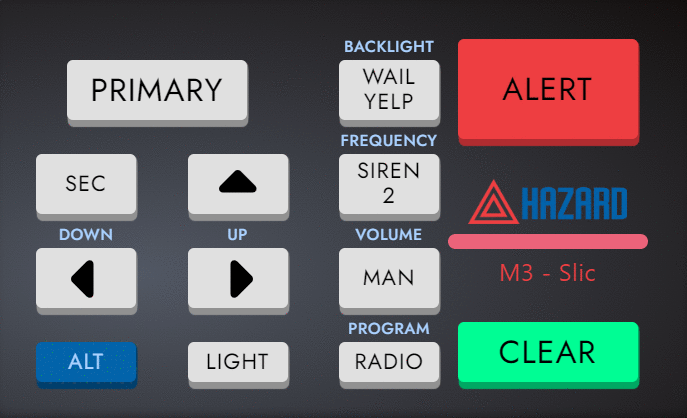

<h1 align="center">Hazard Control Panel System</h1>

The Hazard Control Panel System is an advanced, user-friendly interface designed to manage and control various emergency alert functions. It integrates sound alerts, visual indicators, and system control to ensure efficient response during critical situations.

## Requirements

- [Node > v16](https://nodejs.org/en/)
- [Yarn](https://yarnpkg.com/getting-started/install) / [npm](https://docs.npmjs.com/cli/v10/commands/npm-install)

_A basic understanding of modern web development workflows. If you're unfamiliar with these, React might not be suitable for you at this stage._

## About The Project



The Hazard Control Panel System is designed to streamline the management of emergency alerts and signals. Featuring an array of buttons for specific functions, it allows for quick activation of sound alerts and visual indicators. The system is built to provide clear and immediate feedback to the user, ensuring that emergency responses are both timely and accurate.

### Built With

This project was built with the following technologies:

- [React](https://react.dev/)
- [Typescript](https://www.typescriptlang.org/)

## Getting Started

To get a local copy up and running follow these simple example steps.

### Installation

Please follow the following steps for successful installation:

1. **Clone the Repository:** Get started by cloning the repository to your local machine.

   ```
   https://github.com/Ruminatesoftware/Hazard.git
   ```

2. **Install Packages:** Navigate to the directory and install the required yarn packages by executing the following command in your terminal:

   ```sh
   yarn install
   ```

3. **Run the Project:** Finally, enter the following command in your terminal to start your server:

   ```sh
   yarn start
   ```

   Now, your application should be successfully up and running!

## Features

This setup includes some utilities and examples to use as a foundation.

1. **Alert Function:** Activates the main alert sound with a corresponding visual indicator.

2. **Clear Functionality:** The CLEAR button stops all sounds and resets visual indicators, providing a quick way to manage alerts.

3. **Backlight Indicators:** Green light blinking for buttons, enhancing visibility and attention.

4. **User-Friendly Design:** Intuitive layout with clearly labeled buttons, ensuring ease of use under stressful conditions.

5. **Visual Indicators:** Individual lights for each button enhance visibility.

## Contributing

Contributions are what make the open source community such an amazing place to learn, inspire, and create. Any contributions you make are **greatly appreciated**.

If you have a suggestion that would make this better, please fork the repo and create a pull request. You can also simply open an issue with the tag &quot;enhancement&quot;.
Don&#39;t forget to give the project a star! Thanks again!

1. Fork the Project
2. Create your Feature Branch (`git checkout -b feature/AmazingFeature`)
3. Commit your Changes (`git commit -m "Add some AmazingFeature"`)
4. Push to the Branch (`git push origin feature/AmazingFeature`)
5. Open a Pull Request

## License

Distributed under the [MIT license](LICENSE).

## Contact

If you have any questions or suggestions, feel free to reach out to us:

- Raise an issue on the repository: [GitHub Repository](https://github.com/Ruminatesoftware?tab=repositories)

## Acknowledgments

A special thanks to the following for their contributions, support and inspiration:

- [Ruminate Software](https://ruminate.gohero.us/)
